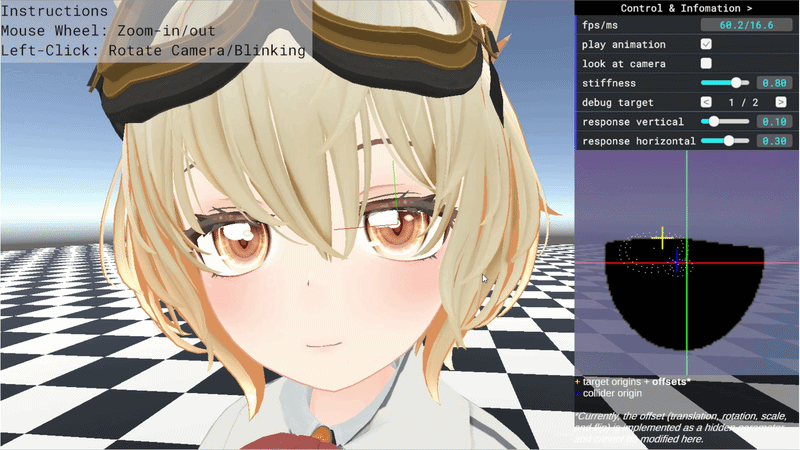

# Dynamic Eye Highlight Deformation via Soft-body Simulation in 3D Anime Character Rendering

元論文 [ [Paper (SIGGRAPH Asia 2025 Posters)](https://dlnext.acm.org/doi/10.1145/3757374.3771483) ]

Unityバージョン：6000.0.49f1

## WebGPU Demo

GIFをクリックするとデモを実行できます。 

推奨環境　PC版 Google Chrome・Microsoft Edge（113以降） 

動作しない場合は、アドレスバーに `chrome://gpu/`（Edgeの場合は `edge://gpu/`）と入力し、
WebGL と WebGPU の項目が `Hardware accelerated` になっているかご確認ください。 

使用させていただいた3Dモデル: RadDollV3 by @三丁目の魔界 ([BOOTH](https://booth.pm/ja/items/3741802))